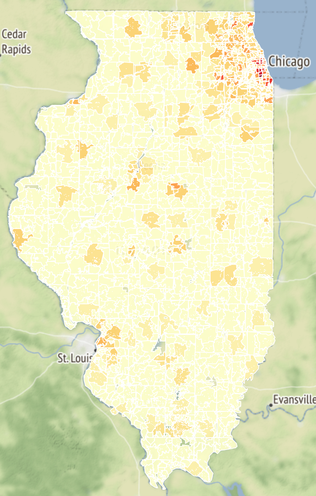

# Illinois_county_choropleth

## Data
1. US Zip Codes 2019: https://www2.census.gov/geo/tiger/TIGER2019/ZCTA5/
1. US Zip codes csv file with population: https://simplemaps.com/data/us-zips
1. Illinois Census ZCTA codes from UC Berkeley: https://geodata.lib.berkeley.edu/catalog/TG00ILZCTA

